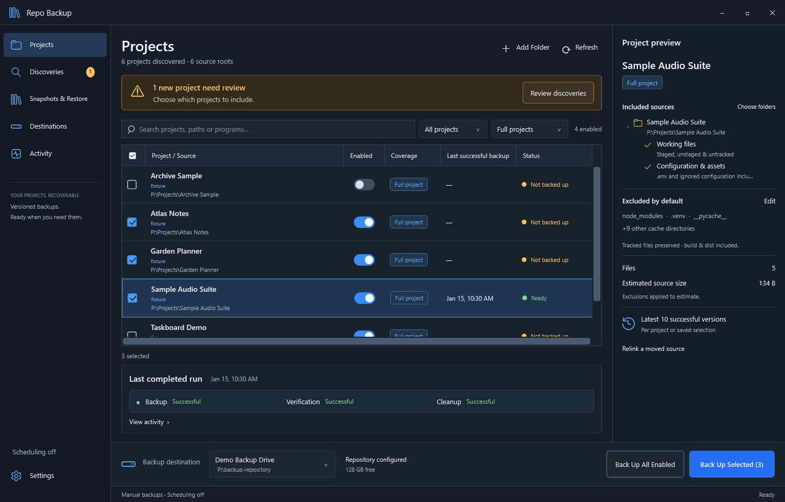

# Repo Backup

A Windows desktop application for versioned backups of Git repositories and project folders, with optional recovery-key protection.

Repo Backup protects the work on your computer: committed history, staged and unstaged changes, untracked files, configuration, assets, and associated Git worktrees. It uses restic to store deduplicated snapshots on a local drive, external drive, or UNC network share. New destinations default to **No password required**; choose **Protect with a recovery key** if you want to restrict access. Browse earlier versions and restore an entire project, a folder, or a single file from the desktop app or CLI.

Built with C# / .NET 10 and WPF, the desktop app, command-line interface, and scheduled runner share the same backup services and SQLite catalog.



*The dashboard shown above was rendered from an isolated synthetic fixture. Regenerate it after building with `powershell -ExecutionPolicy Bypass -File .\scripts\Generate-SyntheticScreenshot.ps1`.*

## Features

- **Project discovery:** find projects from Codex, Claude Code, Antigravity, and saved VS Code workspaces, including Codex, Claude Code, and GitHub Copilot extension associations. VS Code Stable and Insiders are detected automatically. Scan for Git repositories or add any folder manually. Discovered projects enter a review inbox before they can be backed up.
- **Git-aware backups:** full-project snapshots include local Git history, the index, working files, linked worktrees, and local Git LFS and submodule data.
- **Folder selections and previews:** save partial selections, inspect file counts and size estimates, and customize dependency and cache exclusions. Tracked files are preserved; `.gitignore` does not determine backup contents.
- **Versioned recovery:** keep the latest ten successful snapshots per project or saved selection. Partial selections have their own retention series, so they cannot displace full-project recovery points.
- **Verification and restore:** verify repository data, test restores, and recover files into a new directory. Backup, verification, and cleanup results are recorded separately.
- **Optional scheduling:** configure daily, weekly, or interval backups through Windows Task Scheduler. The hidden runner works while the GUI is closed, catches up missed runs, and prevents overlapping scheduled jobs.
- **Portable recovery:** snapshots include recovery manifests. Open the backup repository and rebuild the catalog on a replacement computer. Password-free repositories need only the backup folder; protected repositories also need their exported recovery key.
- **Optional discovery hooks:** register newly used folders through native Codex, Claude Code, or Antigravity hooks. Hooks create review candidates; they do not enable projects or start backups.

## Requirements

- Windows x64.
- A writable backup destination with enough space: a local folder, external drive, or UNC share accessible to the signed-in Windows user.

Published packages include the .NET runtime, native SQLite, restic, and private MinGit and Git LFS executables. End users do not need to install .NET or Git separately, and installation does not change the system `PATH`. Building from source requires Windows PowerShell or PowerShell 7, Git for Windows on `PATH` for the development tests, and internet access for the initial tool and NuGet downloads.

## Install from GitHub Releases

Download `RepoBackup-<version>-win-x64-setup.exe` from [GitHub Releases](https://github.com/c0gen/Repo-Backup/releases) and run it. The installer works offline, installs for the current Windows user without elevation, creates a Start menu shortcut, and registers an uninstaller in Windows Settings. A desktop shortcut is optional.

Close Repo Backup and wait for scheduled operations to finish before installing an update. Run the newer installer over the existing installation. Your catalog, credentials, settings, and backup repositories are kept. Scheduling starts disabled on a new installation.

The ZIP is also available for portable use. See [Packaging and releases](docs/PACKAGING.md) for building installers, verifying checksums, and publishing release assets.

## Build and run

From the repository root, run:

```powershell
powershell -ExecutionPolicy Bypass -File .\scripts\Build.ps1 -Publish
.\dist\RepoBackup\RepoBackup.exe
```

The build script bootstraps the pinned .NET SDK **10.0.401** into `.tools`, downloads and verifies restic **0.19.1**, restores the dependencies, and builds the solution. The SDK archive is checked with SHA-512; the restic archive and executable are checked with SHA-256. Builds and publishing enforce committed `packages.lock.json` files. Existing restic 0.18.0 repositories remain supported in both protection modes.

Publishing produces:

| Output | Contents |
| --- | --- |
| `dist/RepoBackup/` | Self-contained Windows x64 app, CLI, hidden runner, .NET runtime, native SQLite, restic, MinGit, Git LFS and licenses, script installer, documentation, and SHA-256 package manifest |
| `dist/RepoBackup-<version>-win-x64.zip` | Distributable archive of the published application |
| `dist/SHA256SUMS` | SHA-256 checksums for the release assets |

To also build the graphical installer, use `-Installer` (which includes publishing):

```powershell
powershell -ExecutionPolicy Bypass -File .\scripts\Build.ps1 -Test -Installer -Version 1.0.0
```

This adds `dist/RepoBackup-1.0.0-win-x64-setup.exe`. The pinned Inno Setup compiler is bootstrapped in portable mode under `.tools`; it does not need to be installed globally. Releases are built, reviewed, and uploaded manually as described in [Packaging and releases](docs/PACKAGING.md). Read-only CI validates disposable packages and never publishes a release or stores build artifacts.

For a build without packaging, omit `-Publish`. Build outputs, downloaded tools, test artifacts, and published packages are ignored by Git.

### Optional per-user installation

After publishing, run:

```powershell
powershell -ExecutionPolicy Bypass -File .\dist\RepoBackup\Install.ps1
```

This legacy script verifies the package hashes, copies the application to `%LOCALAPPDATA%\Programs\RepoBackup`, and creates a Start menu shortcut. The graphical installer uses the same stable path and also registers an uninstaller. Use this path for scheduling and discovery hooks. Close the installed app and wait for scheduled operations to finish before updating it.

## First backup

The first launch opens a short setup wizard. Existing configured installations open the normal Projects screen.

1. **Destination:** Choose an empty folder on your backup drive or share, then choose **Save and continue**. **No password required** is selected by default. To reconnect backups, choose **Open an existing restic repository** instead.
2. If you choose **Protect with a recovery key**, acknowledge the recovery warning and export the key when offered. Keep it somewhere safe, separate from the backup drive. You can skip the offer and export later from **Destinations**, but the key is required for recovery on another computer.
3. **Discoveries:** Review the projects found on this computer and include the ones you want to protect. You can also add a folder manually or scan for Git repositories. Include at least one available project to continue.
4. **Review in Projects:** Check the destination and included projects, then choose **Open Projects**. The available projects you included are selected. Review the source preview and exclusions, then choose **Back Up Selected** or **Back Up All Enabled**.
5. Check backup, verification, and cleanup results in **Activity**. Use **Snapshots & Restore** to browse recovery points or perform a test restore.

Choose **Do this later** to leave setup at any point when no configuration is being saved. Your saved destination and project choices are kept. **Continue setup** resumes from the next unmet prerequisite; the wizard does not reopen automatically after dismissal. You can also reopen it from **Settings → Review setup**. For recovery from an existing repository, leave the wizard and use **Destinations → Rebuild catalog from snapshots**, then browse **Snapshots & Restore**.

Setup does not start a backup or enable scheduling. Enable scheduling in **Settings** after configuring the projects and destination you want to use. Loading indicators distinguish pending information from empty results, and failed reads offer a retry in the affected panel.

## Backup contents and recovery

Full-project backups include Git metadata, unfinished changes, untracked and ignored configuration such as `.env`, and project assets. Known dependency and cache directories such as `node_modules`, `.venv`, `__pycache__`, and `obj` are excluded by default, with tracked files preserved. Generic `build` and `dist` folders remain included unless you explicitly exclude them. Review the preview to see the rules for each project or saved selection.

Protected destinations save their credentials with Windows DPAPI for the current user. Password-free destinations generate no saved credential. Restic still uses its encrypted storage format in password-free mode, but anyone with the repository can unlock it; backups are restored through Repo Backup or restic rather than browsed as ordinary files. The catalog, credentials, job metadata, cache, and locks live under `%LOCALAPPDATA%\RepoBackup`. Catalog exports omit credentials; export protected destinations' recovery keys separately. Pass `--data-dir <absolute-directory>` to the app or CLI to use an isolated catalog.

Restores use a new directory. Git recovery reconstructs worktree and submodule paths inside the restored copy without modifying the original repository. The backup repository is sufficient to rebuild a catalog on a replacement computer; protected repositories additionally require their recovery key. Existing repositories keep their current protection when upgrading or opening them.

See [Recovery instructions](docs/RECOVERY.md) for full and selective restores, replacement-computer recovery, and verification details.

## Command-line usage

The packaged CLI is `dist/RepoBackup/RepoBackup.Cli.exe`. From the repository root:

```powershell
$cli = '.\dist\RepoBackup\RepoBackup.Cli.exe'
& $cli help
& $cli discover
& $cli discover --source claude-code
& $cli discover --source vscode
& $cli discover --source copilot
& $cli add-folder --path 'C:\Projects\Example' --name 'Example'
& $cli destination-add --name 'Backup Drive' --path 'E:\RepoBackups'
& $cli projects
& $cli destinations
```

Copy the destination ID returned by `destinations`, then use it to back up enabled projects and check their snapshots:

```powershell
$destinationId = 'paste-destination-id-here'
& $cli backup --destination $destinationId --all-enabled
& $cli snapshots --destination $destinationId
& $cli verify --destination $destinationId
```

The CLI also supports previews, saved selections, catalog import/export, schedules, recovery-key export, and restore operations. `destination-add` and `destination-open` default to password-free mode. Use `--protection recovery-key` to create a protected repository, then `key-export` to save its key. Supplying `--key-file <file>` selects recovery-key protection automatically; it cannot be combined with `--protection password-free`. Existing protected repositories are opened with `destination-open --key-file <file>`. Run `help` for the full command list and see [Discovery and hooks](docs/DISCOVERY.md) for provider-specific paths and overrides.

| Exit code | Meaning |
| --- | --- |
| `0` | Success |
| `1` | Command error |
| `2` | Incomplete or failed backup, verification, or backup cleanup |
| `130` | Cancellation |

## Development and testing

Run secret scanning, a live NuGet vulnerability audit (including transitive dependencies), and the full Windows acceptance suite:

```powershell
powershell -NoProfile -ExecutionPolicy Bypass -File .\scripts\Verify.ps1
```

To also build and smoke-test the portable package:

```powershell
powershell -NoProfile -ExecutionPolicy Bypass -File .\scripts\Verify.ps1 -Package
```

Use `Verify.ps1 -Installer` on a clean Windows machine for both portable and installer smoke tests. The installer test refuses to overwrite an existing installation or Start menu shortcut. `Build.ps1 -Test` remains available for a faster build/acceptance-only run. Validation requires internet access and fails if vulnerability data cannot be retrieved or any known vulnerability is reported. See [Security maintenance](docs/SECURITY.md) for intentional lock-file updates and native-tool checks.

The executable test suite uses real restic repositories and generated Git fixtures under `.artifacts`. It covers discovery, catalog migration, native hook callbacks, working-file hashes, Git worktrees and submodules, selective restores, retention, cancellation, destination locks, and recovery with a fresh catalog. Tests do not back up user projects.

After building the solution, run the smaller catalog, discovery, CLI, and hook suite with:

```powershell
.\tests\RepoBackup.Tests\bin\Release\net10.0-windows\RepoBackup.Tests.exe --unit
```

The test executable also accepts `--edge-only` for the unit checks plus link, low-space, live-change, and external Git-data tests. [Validation notes](docs/VALIDATION.md) describe coverage and hardware checks.

### Project structure

| Path | Responsibility |
| --- | --- |
| [`src/RepoBackup.Core`](src/RepoBackup.Core) | Shared application services, SQLite catalog, discovery, selection rules, restic integration, Git recovery, credentials, and scheduling |
| [`src/RepoBackup.Desktop`](src/RepoBackup.Desktop) | WPF desktop interface, theme, views, and view models |
| [`src/RepoBackup.Cli`](src/RepoBackup.Cli) | Interactive command-line interface |
| [`src/RepoBackup.Runner`](src/RepoBackup.Runner) | Hidden scheduled and discovery-hook runner |
| [`tests/RepoBackup.Tests`](tests/RepoBackup.Tests) | Executable unit, backup/recovery, and Windows integration fixtures |
| [`scripts`](scripts) | SDK bootstrap, dependency downloads, build, packaging, and installation |
| [`docs`](docs) | Discovery, recovery, and validation guides |
| [`vendor/restic`](vendor/restic) | Restic license and locally downloaded backup executable |

## Scope and operating limits

The implemented scope is one Windows user backing up projects to local or UNC destinations. Cloud backends, bidirectional synchronization, and whole-machine recovery are outside the current scope.

Live backups can observe files changing during a run and cannot guarantee that every file represents a single instant. Unavailable drives, unreadable files, unresolved Git data, and unhydrated cloud placeholders can produce incomplete coverage. Failed or incomplete backups do not trigger retention cleanup. An explicit VSS mode is available for elevated backups; it requires Administrator rights. Restoring Windows symbolic links may require Developer Mode or elevation.

Discovery depends on each program's local storage format. Invalid sources generate provider-specific warnings while the other providers continue. Only project metadata is retained; discovery does not persist conversations, credentials, or hook payloads. Native hooks are optional and follow each program's own review flow. Antigravity hooks require a build with native Hooks support.

## Documentation

- [Recovery and replacement-computer setup](docs/RECOVERY.md)
- [Project discovery and optional hooks](docs/DISCOVERY.md)
- [Validation coverage and operating limits](docs/VALIDATION.md)
- [Installer packaging and GitHub Releases](docs/PACKAGING.md)
- [Security validation and dependency maintenance](docs/SECURITY.md)

## Third-party software

Repo Backup uses restic as its backup engine. Its license is included at [`vendor/restic/LICENSE`](vendor/restic/LICENSE) and distributed with the application. Release packages include [MinGit](https://gitforwindows.org/mingit) and [Git LFS](https://github.com/git-lfs/git-lfs), with their licenses and dependency notices retained under `git/`. The solution also uses NuGet dependencies recorded in the project files and lock files.

## License

Repo Backup is licensed under the [MIT License](LICENSE).
